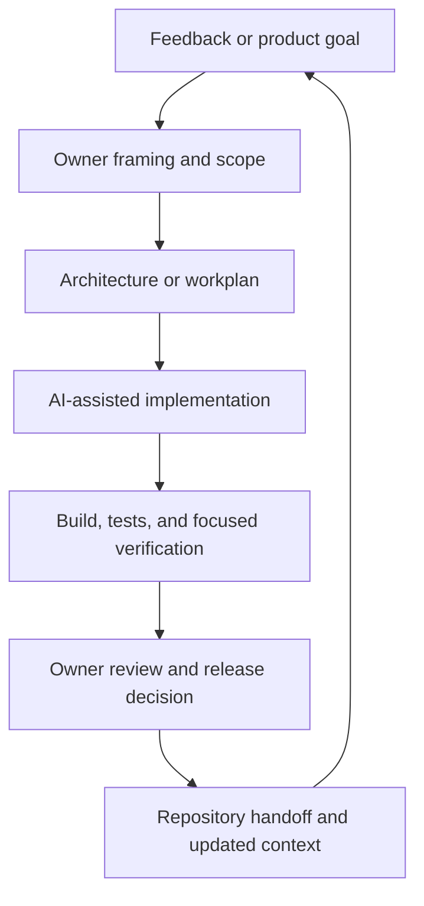
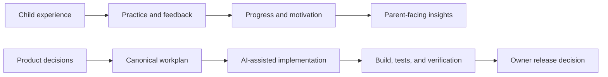

# KidsTutor — A Closed-Source Product Case Study

KidsTutor is a proprietary Hebrew/English mathematics-learning product for children across multiple grade levels. This repository documents the product decisions, AI-native operating model, and verification discipline behind the work.

It intentionally contains **no production source code**, private Git history, real child data, database design, curriculum generators, proprietary algorithms, production configuration, or commercial roadmap.

## The product challenge

Learning software for children has to succeed on several dimensions at once:

- The educational content must be correct and age appropriate.
- The interface must work across desktop, tablet, and touch-first devices.
- Hebrew introduces vocalization, speech, and bidirectional-layout concerns.
- Feedback must help a child recover from mistakes without interrupting momentum.
- Motivation systems must encourage practice without taking over the learning experience.
- Parents need useful progress signals without turning the child's experience into an analytics dashboard.

KidsTutor became a working environment for making and validating those tradeoffs rather than treating them as isolated features.

## What was built

The private product includes:

- Localized mathematics practice
- Grade-specific question experiences
- Worked feedback and explanations
- Hebrew vocalization support
- Touch-friendly scratch work
- Progress, achievements, ranks, and personalization
- Parent-facing progress reporting
- Sharing and celebration experiences
- Supporting simulation, generation, and verification tools

The implementation remains proprietary. This case study focuses on how the product was directed and operated.

## Selected product decisions

### 1. Treat touch interaction as a different product environment

A child using a tablet does not experience focus, keyboards, scrolling, or scratch work the way a desktop user does. The product evolved away from automatic keyboard behavior and toward explicit, child-controlled interaction. Scratch work was designed as part of the question flow rather than as a detached utility.

### 2. Make Hebrew legible to learners, not merely correct to adults

Unvocalized Hebrew can be difficult for children to sound out and can produce unreliable text-to-speech pronunciation. Vocalization was added across learning content and checked through independent tools plus deterministic letter-level validation. The verification workflow became reusable so later content would not depend on memory or manual inspection alone.

### 3. Convert feedback into traceable product work

Feedback was mapped into a canonical workplan rather than scattered across conversations and notes. Each meaningful change connected an observation to a decision, implementation, and verification step. Raw feedback and identifying information remain private.

### 4. Treat the motivation economy as a system

Ranks, experience points, rewards, and shop items were centralized into a coherent policy and mechanism. The goal was not simply cleaner code: it was to make future product tuning safer, comparable, and testable without silent drift between duplicated rules.

### 5. Separate the child and parent experiences

Parent reporting should answer progress questions without adding administrative weight to the child's learning flow. Early reporting work was therefore developed as a separate operational capability before being considered as product UI.

## An AI-native operating model

AI coding agents accelerated implementation, but product ownership remained human-led.

The operating model used:

- Persistent repository context across AI tools
- Explicit cross-tool handoffs
- One canonical workplan
- Decision and architecture documents
- Owner-approval gates
- Small, revertible changes
- Build and test verification before completion claims
- Reusable scripts and skills for repeated workflows

AI was the implementation layer. Product direction, tradeoffs, approval, and accountability remained with the owner.

## Evidence snapshot

At the audited July 12, 2026 project snapshot:

- The TypeScript production build completed successfully.
- The unit suite reported 209 passing tests across 16 test files.
- Economy policy and catalog data had been centralized with parity checks against prior behavior.
- Mobile, localization, content-verification, reporting, and asset-generation workflows were represented in the project history and documentation.

These are dated repository-backed observations, not claims about educational outcomes.

## High-level architecture

This diagram intentionally omits production schemas, endpoints, infrastructure details, algorithms, and security boundaries.

## What remains proprietary

The following are not disclosed:

- Production source and Git history
- Curriculum and question-generation logic
- Scoring and answer-evaluation algorithms
- Economy configuration and simulation internals
- Database schemas and migrations
- Authentication and account linking
- Operational analysis and parent-report implementation
- Agent prompts and complete internal instructions
- Raw feedback and all child or parent data
- Production configuration
- Commercial roadmap and monetization mechanics

## Repository purpose

This is a documentation-only portfolio artifact. It demonstrates product thinking, operating design, and delivery evidence without licensing or distributing the underlying product.

See:

- [Product thinking](docs/product-thinking.md)
- [AI-native operating model](docs/ai-native-operating-model.md)
- [Architecture overview](docs/architecture-overview.md)
- [Decisions and tradeoffs](docs/decisions-and-tradeoffs.md)
- [Privacy and disclosure boundary](docs/privacy-and-synthetic-data.md)
- [Media capture plan](media/SHOT-LIST.md)

## Status

KidsTutor remains a closed-source product under development. This repository is not the application, an SDK, a distribution, or an offer of source-code access.

## Rights

Copyright © Guy Assedou. All rights reserved. See [LICENSE.md](LICENSE.md).

