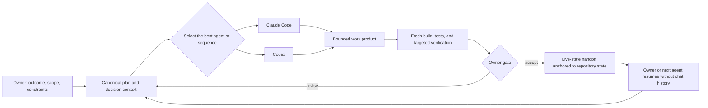
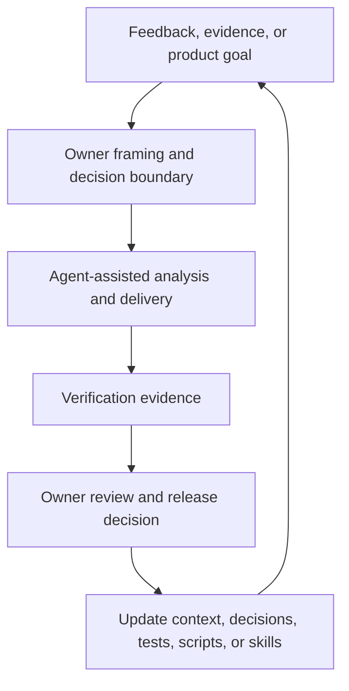

# The AI-Native Product Operating System

## Beyond AI-assisted coding

KidsTutor was not built by opening a chat window, generating features, and manually stitching the results together. I designed an operating system that allows two coding agents—**Claude Code and Codex**—to work across sessions from shared, durable product context.

The agents do not need access to each other's conversation history. Product memory, current state, decision rationale, work boundaries, and verification expectations live in the repository. Either agent can recover the state of the product, perform a bounded piece of work, leave evidence, and hand control to the owner or the other agent.

This is the central AI-native practice: the intelligence is not confined to a model or prompt. It is embedded in the operating environment around the models.

## The control plane

The product owner remains the control plane. Claude Code and Codex are implementation and analysis capacity operating inside explicit boundaries.

The owner is responsible for:

- Framing the problem and desired outcome
- Setting priorities and defining scope
- Approving consequential product and architecture decisions
- Resolving tradeoffs and deciding what remains out of scope
- Selecting the appropriate agent or sequence of agents
- Reviewing evidence rather than accepting completion claims
- Making release and commercial decisions

The agents can research, challenge assumptions, plan, prototype, implement, test, document, and prepare handoffs. They do not silently convert an idea into approved product behavior.

## The operating stack

The private product repository contains a layered context system. Each artifact has one job; no single document tries to hold the entire project.

| Layer | Purpose |
|---|---|
| Agent entry point | Routes both tools into the same operating instructions and current context |
| Durable project context | Captures stable conventions, known failure modes, reusable workflows, and verification expectations |
| Live handoff | Records what is true now: the current commit, working-tree condition, completed and unfinished work, current verification, blockers, and the next recommended step |
| Canonical workplan | Holds priorities, approval gates, dependencies, and delivery status without duplicating live session state |
| Architecture and decision records | Preserve why consequential choices were made and what was deliberately excluded |
| Git history | Provides the chronological audit trail and independently reversible changes |
| Tests, scripts, and reusable skills | Turn repeated instructions and quality expectations into executable operating memory |

This separation matters. The handoff is a snapshot, not a diary. The workplan answers what should happen. Decision records answer why. Git answers what changed. Tests and scripts answer whether the system still satisfies its rules.

## Two agents, one source of truth

Claude Code and Codex are not maintained as two separate project brains. They enter through the same repository context and must leave the project in a state the other can understand.

Their roles are selected by the work rather than permanently assigned. One agent may explore a problem, develop an analytical tool, or propose an approach. The other may resume from that checkpoint, challenge the assumptions, integrate the work into the broader architecture, or independently verify the result.

The important design decision is that the baton pass is planned. The second agent should not have to reverse-engineer the first agent's transcript or infer whether the work is complete.

## The handoff contract

The live handoff is the coordination mechanism between sessions and agents. It is overwritten with the current truth instead of accumulating as an ambiguous activity log.

A valid handoff records:

- Which agent last operated and the repository state it was working from
- Whether the working tree is clean, intentionally parked, or contains owner-protected material
- What was completed and what is still partial
- Bugs or risks discovered but not resolved
- Architecture, schema, workflow, or tooling changes made during the session
- Build and test results run in the current session—not copied from an earlier claim
- Decisions or approvals required from the owner
- The most useful next action for the owner or next agent

If priorities or feature status changed, the canonical workplan is updated as well. If the rationale changed, the architecture or decision record is updated. The handoff does not duplicate either one.

## A real cross-agent baton pass

The model has been exercised on consequential product work, not only documented as a future intention.

In one example, Codex developed analytical groundwork for a product-economy decision. The work and its state were made recoverable through repository artifacts rather than left inside a Codex conversation. Claude Code then resumed the work, evaluated the approach in the context of the production architecture, identified a brittle dependency, and reworked the foundation around a stronger single source of truth.

The second agent did not simply continue generating from where the first stopped. It reviewed, challenged, integrated, and re-verified. The owner retained the decision about whether and when to change the underlying product policy.

The pattern was:

1. Owner frames the product question and the decision boundary.
2. Agent one explores, models, or creates bounded groundwork.
3. Repository state and limitations are made explicit.
4. Agent two resumes from the artifacts, not the prior transcript.
5. Agent two tests the approach against the wider system and improves or rejects it.
6. Current verification evidence and unresolved owner decisions are written back into the operating system.

That is planned agent orchestration, not parallel prompting.

## Decision and approval gates

Speed creates value only if the system prevents fast ambiguity from becoming shipped behavior.

KidsTutor uses explicit gates, including:

- Product and architecture review before consequential implementation
- Owner approval of experience concepts before visual changes move into the product
- Clear separation between exploration, approved work, and released behavior
- Explicit out-of-scope decisions to prevent agents from opportunistically expanding a task
- One logical, independently reviewable change at a time
- Reversible commits and intentionally parked branches for uncertain work
- No simultaneous writes by two agents to the same checkout
- Protection of raw feedback, personal data, credentials, and other owner-controlled material

These controls allow agents to be assertive inside a task without quietly taking ownership of product strategy.

## Verification as executable governance

An AI-native operator cannot use generated confidence as evidence. Completion is tied to current, reproducible checks.

The operating system distinguishes several forms of proof:

- **Build verification** confirms that the product compiles as a complete system.
- **Focused tests** validate the behavior directly changed.
- **Regression suites** detect effects outside the immediate task.
- **Parity checks** prove that a structural change preserved existing behavior where required.
- **Content-specific validators** turn recurring quality risks into deterministic checks.
- **Real-browser or owner verification** is required when automated environments cannot reproduce the user experience faithfully.
- **Explicit uncertainty** records what has not yet been proved instead of allowing it to be described as complete.

When the same problem or workflow recurs, it is converted into a test, script, preview environment, or reusable skill. The system becomes more capable after each meaningful failure instead of repeatedly paying the same coordination cost.

## The compounding loop

Each delivery cycle can improve both the product and the way the product is built.

Examples of compounding behavior include:

- A discovered failure mode becomes a regression test.
- A fragile manual check becomes a deterministic validator.
- A repeated asset or content workflow becomes a reusable skill.
- A consequential tradeoff becomes a durable decision record.
- A session-specific discovery becomes context available to either agent.
- A one-off analytical need becomes a reusable decision-support tool.

This is how AI creates operational leverage rather than merely increasing code output.

## Why this is an AI-native product practice

The operating model changes the structure of product delivery:

- **Model independence:** project memory survives changes in tools, models, and sessions.
- **Multi-agent continuity:** Claude Code and Codex can inspect, challenge, and extend each other's work through shared artifacts.
- **Human leverage:** the owner spends more time on framing, tradeoffs, approval, and evidence while agents supply implementation and analytical capacity.
- **Governed speed:** acceptance criteria, approval gates, and executable verification constrain fast generation.
- **Organizational memory:** decisions, failures, and workflows become reusable infrastructure.
- **Planned handoffs:** switching agents is a designed operating move rather than a recovery from lost context.
- **Compounding capability:** the delivery system becomes stronger as tests, scripts, skills, and decision records accumulate.

The result is not an autonomous product organization. It is a deliberately designed product operating system in which human judgment directs multiple AI agents and repository-based mechanisms preserve continuity, quality, and accountability.

## Disclosure boundary

This case study describes the operating architecture and public-safe evidence. The complete agent instructions, internal prompts, private handoff state, raw feedback, production configuration, source code, and proprietary product logic remain private.

