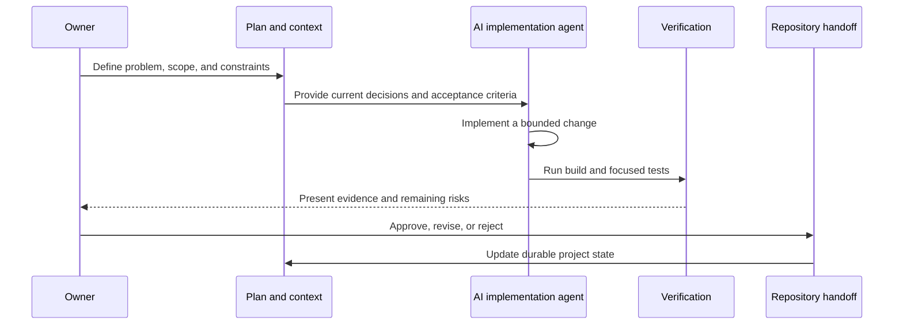

# AI-Native Operating Model

## Principle

AI accelerates implementation; it does not own product direction.

The owner remains accountable for:

- Problem framing
- Priority and scope
- Architecture decisions
- Tradeoffs
- Approval
- Verification expectations
- Release decisions

## Repository context as operating infrastructure

Long-running AI-assisted work fails when critical decisions live only in conversation history. KidsTutor uses repository-based context so a new tool or session can recover the current state without reconstructing the project from memory.

The model includes:

- A concise session handoff
- A canonical workplan
- Architecture documents for consequential decisions
- Durable workflow instructions
- Tests and scripts that encode repeatable verification

## Work lifecycle

## Guardrails

- One logical change should be independently reviewable and reversible.
- Completion claims require current build and test evidence.
- Uncertain work is labeled rather than silently treated as shipped.
- The workplan has one canonical status source.
- Architecture documents explain why; handoffs explain current state.
- Repeated workflows become scripts or skills rather than recurring prose instructions.
- Multiple agents do not write concurrently to the same checkout.

## Why this matters beyond coding

The value is not merely faster implementation. The operating system improves continuity, reviewability, and decision quality. It allows the owner to use different implementation tools without surrendering the product's memory or standards to any one tool.

