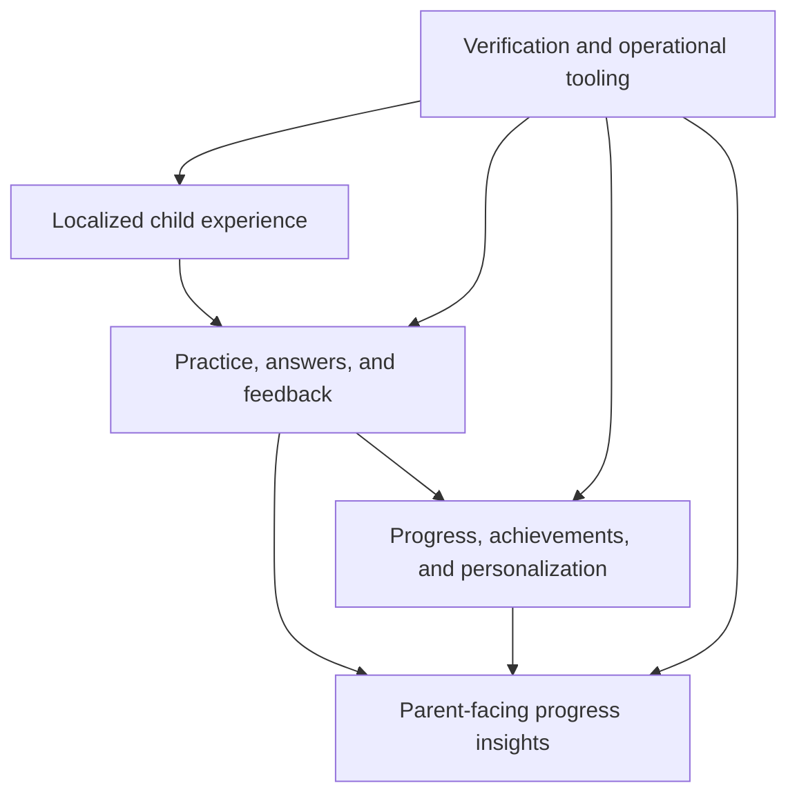

# Architecture Overview

This document intentionally stays at the product-system level. It does not disclose production endpoints, schemas, infrastructure configuration, algorithms, or security implementation.

## Product layers

## Architectural principles

### Keep learning behavior deterministic

Questions, answers, progression, and trusted state should not depend on an unverified generative response at the moment a child uses the product.

### Separate policy from mechanism

Values likely to change through product tuning should be centralized as policy. Calculations and eligibility rules should remain deterministic mechanisms with focused tests.

### Verify transformations

Generated or transformed content requires a validation layer. Tool output is evidence to inspect, not proof of correctness.

### Keep child and parent responsibilities distinct

The product can share underlying progress state while presenting different experiences and permissions to children and parents.

### Treat production data as private

Demonstrations and public materials must use synthetic data. Operational analysis and reporting should not create a public path to child or parent records.

## Deliberate omissions

This case study does not document:

- Database design
- API boundaries
- Authentication
- Deployment topology
- Curriculum implementation
- Scoring rules
- Economy values
- Production analytics
- Commercial roadmap

